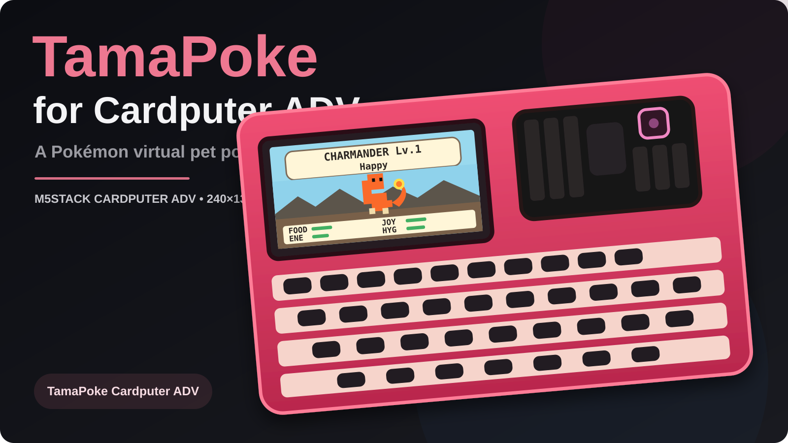

# TamaPoke Cardputer ADV



An unofficial **M5Stack Cardputer ADV** port of TamaPoke, adapted for the Cardputer ADV's 240×135 display, keyboard, speaker, battery monitoring and microSD.

> **Current stable release:** [v0.8.5.4](https://github.com/DezTheGod777/TamaPoke-CardputerADV/releases/tag/v0.8.5.4), built from RC5 source. Cyber Den beta is not included.

## Download

[Download TamaPoke-CardputerADV.bin — v0.8.5.4](https://github.com/DezTheGod777/TamaPoke-CardputerADV/releases/download/v0.8.5.4/TamaPoke-CardputerADV.bin)

Use the BIN attached to the release, not files from older commits or beta branches. Back up your microSD pet saves before updating. The published release has passed its automated build; hardware validation is separate and is not asserted here.

## v0.8.5.4 highlights

- Random black-screen timeout race fixed while preserving **Off / 30 sec / 1 min / 2 min / 5 min** timeout choices.
- **G0 / BtnA** toggles the display backlight manually; the old `SCREEN OFF NOW` Settings item is removed.
- Compact **battery meter** in the upper-right with low-battery warning during normal UI screens.
- **Terrarium/idle mode stays completely clean**: no `IDLE` label, no battery icon and no SAVE overlay.
- Restores the **classic pre-RC3 TamaPoke habitat/background renderer** instead of the experimental redesigned scenery.
- Restores the original graphical **FOOD / JOY / ENE / HYG meters** instead of raw numeric boxes such as `FOOD 82` or `JOY 92`.
- Brief **SAVE** indicator after background persistence is flushed during normal UI use.
- Visible firmware version and dedicated **About / Version** screen with upstream/port credits, SD status, sprite status and battery details.
- **Recent Events** history for level-ups, Pokédex discoveries, medals, records, care mistakes, bond milestones, renames and evolutions.
- **Reset Display** recovery option that restores display preferences without deleting pet progress.
- Terrarium idle mode after 30 seconds on Home: menus disappear while the Pokémon continues animating in the classic habitat. Any key returns to normal Home; the configured screen timeout continues separately.
- Richer PMD personality behavior using idle, walk, pose, nod, breathing, sit, hop, hurt and attack animations when available.
- Special spectral atmosphere for **Gastly #092, Haunter #093 and Gengar #094**.
- More dramatic evolution presentation: silhouette transformation, accelerating flashes, reveal and evolved Pokémon presentation.
- Improved Pokédex detail page with animated preview, current/raised status, type-theme, habitat, rarity, stats, evolution information and shiny treatment.
- Enhanced shiny sparkle effects and visible shiny badge.
- Existing starter selection, egg/hatching, feeding, bathing, petting, sleep, play/training mini-games, medals, streaks, farewell/runaway lifecycle and Gen-1 Pokédex remain intact.
- Pet save journal remains compatible with v0.7 `/tamapoke_v7_a.bin` and `/tamapoke_v7_b.bin`.

## Controls

| Control | Action |
|---|---|
| Left / Right | Select Home action / browse pages |
| Up | Pet card |
| Down | Settings |
| Enter | Confirm / selected action |
| Space | Pet / mini-game action |
| F | Feed |
| P | Play |
| L | Sleep / wake |
| B | Bath |
| D | Pokédex |
| I | Pet info |
| E | Evolve when ready |
| G | Farewell / runaway when available |
| N | Rename from Profile |
| R | Release |
| S | Sound on/off |
| 1 | Toggle Home name/status header |
| Esc / Backspace | Back |
| **G0 / BtnA** | **Manual display on/off** |

The Cardputer's printed arrow keycaps (`; , . /`) are accepted directly without requiring Fn.

## Pokémon sprites on microSD

The port does **not** bundle the Pokémon sprite pack. Generate the original TamaPoke/PMD files and put the `mons` directory at the root of a FAT32 microSD card:

```text
/mons/p001.bin
...
/mons/p151.bin
/mons/ps001.bin
...
/mons/ps151.bin
```

Normal Pokémon use `pNNN.bin`; shiny Pokémon use `psNNN.bin` with normal-sprite fallback.

## Persistence

Pet progress uses the v0.7-compatible two-slot journal:

```text
/tamapoke_v7_a.bin
/tamapoke_v7_b.bin
```

Additional Cardputer ADV files:

```text
/tamapoke_display.cfg
/tamapoke_events.log
```

Display recovery does not erase Pokémon progress.

## Building

The project uses PlatformIO and automatically fetches the pinned upstream TamaPoke pet/dex source during the build.

```text
pio run -e m5stack-cardputer-adv
```

GitHub Actions also builds the merged Cardputer ADV firmware image.

## Credits

- Original TamaPoke: **socquique/TamaPoke**
- Cardputer ADV port: **DezTheGod777**
- Pokémon/PMD artwork remains subject to its respective owners and PMD SpriteCollab licensing; those sprite assets are not bundled with this repository.

## Development status

The main branch uses the v0.8.5.4 release source, with documentation cleanup. For the exact published source, use tag `v0.8.5.4`.

Cyber Den work is preserved on `final-candidate-cyberden` and the [pre-cleanup archive branch](https://github.com/DezTheGod777/TamaPoke-CardputerADV/tree/archive/cyber-den-pre-stable-cleanup). It is not included in main or the stable release. The release tag and its BIN are unchanged by this cleanup.
